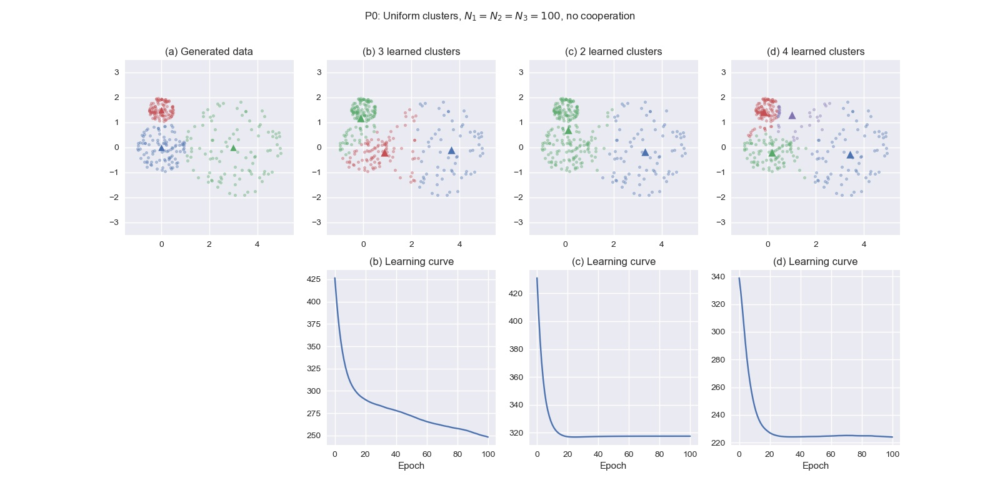

# Homework 1: Clustering

In this homework, I implemented a solution to the clustering problem using 
the self-organizing principle. Specifically,
- Competition is implemented through the activation of the center nearest 
to each input.
- The Gaussian neighborhood function is applied to a simplified version of 
Kohonen's self-organizing map, using only 2, 3, and 4 neurons in the output 
topology.
- Adaptation is through a batch learning rule, i.e., at each epoch, all inputs 
activating a neuron are averaged and approximated as a single input.

For results, see **Examples** below.

## How to use it

Packages used are `numpy` (for matrix operations), `matplotlib` (for plotting), 
and `pandas` (for csv file handling).

1. Generate the data with
```python
from generate import generate

C1 = [[0,0], [3,0], [0,1.5]]
R1 = [1, 2, 1/2]
N1 = [100, 100, 100]

generate.generate(type = 'uniform', C = C1, R = R1, 
	N = N1, path = 'P1/P1.csv')
```

2. Let the model self-organize and save results with
```python
from som import SOM

# 3 clusters
P1b = SOM(n_cluster = 3)
P1b.learn('P1/P1.csv')
pd.DataFrame(P1b.clusters).to_csv('P1/b.csv', 
	header = None, index = None)
pd.DataFrame(P1b.error).to_csv('P1/bE.csv',
	header = None, index = None)
pd.DataFrame(P1b.weights).to_csv('P1/bW.csv',
	header = None, index = None)
```

3. Plot the results with
```python
from plot import plot_cluster, plot_weight, plot_error

plt.figure(figsize = (16,8))
plt.suptitle('P1: Uniform clusters, $N_1 = N_2 = N_3 = 100$')

# Generated data
plt.subplot(241)
plt.title('(a) Generated data')
plot_cluster('P1/P1.csv', [-1,5], [-3,3])
i = 0
for c in C1:
	plt.scatter(c[0], c[1], color = palette[i], marker = '^')
	i += 1


# 3 clusters
plt.subplot(242)
plt.title('(b) 3 learned clusters')
plot_cluster('P1/b.csv', [-1,5], [-3,3])
plot_weight('P1/bW.csv')

plt.subplot(246)
plt.title('(b) Learning curve')
plot_error('P1/bE.csv')
```

## Examples

5 cases are examined as follow, with P0 having no cooperation for comparison.




