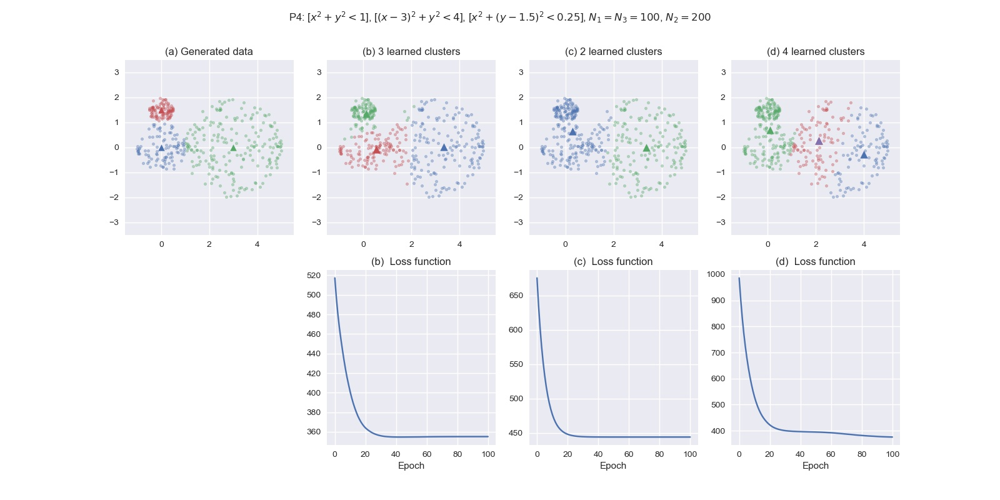

# Homework 1: Self-Organizing Clusters

In this homework, I implemented a solution to the clustering problem using 
the self-organizing principle. Specifically,
- Competition is implemented through the activation of the center nearest 
to each input.
- The Gaussian neighborhood function is applied to a simplified version of 
Kohonen's self-organizing map, using only 2, 3, and 4 neurons in the output 
topology.
- Adaptation is through a batch learning rule, i.e., at each epoch, all inputs 
activating a neuron are averaged and approximated as a single input.

## Examples

These are examples using uniformly distributed clusters. Note that normally 
distributed clusters can also be generated using

```python
generate.generate(type = 'gaussian', mean, cov, N, path)
```


