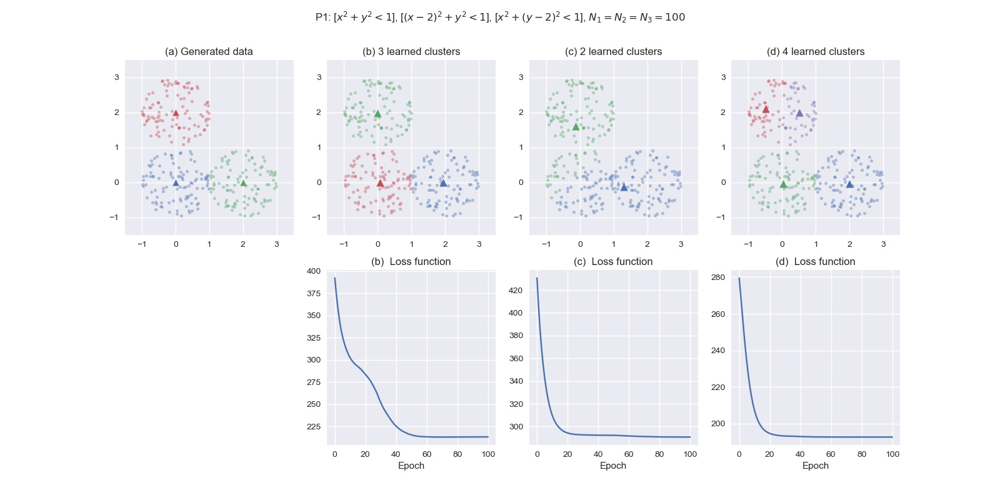
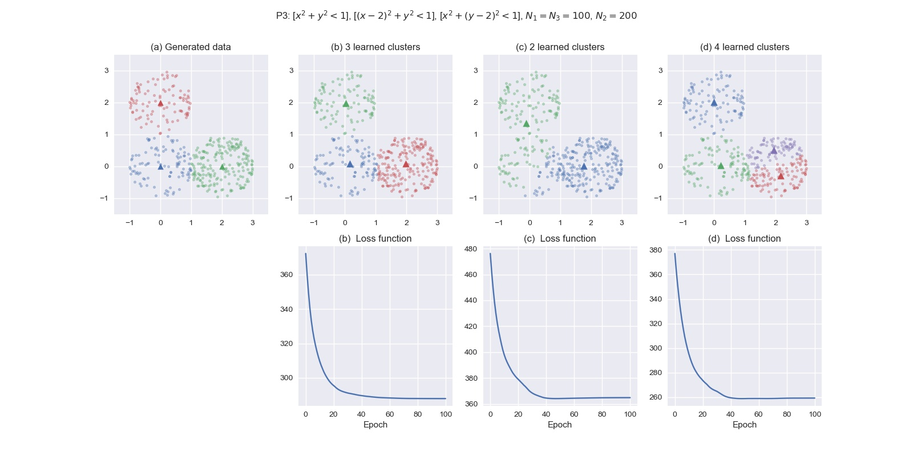

# Homework 1: Clustering

In this homework, I implemented a solution to the clustering problem using 
the self-organizing principle. Specifically,
- Competition is implemented through the activation of the center nearest 
to each input.
- The Gaussian neighborhood function is applied to a simplified version of 
Kohonen's self-organizing map, using only 2, 3, and 4 neurons in the output 
topology.
- Adaptation is through a batch learning rule, i.e., at each epoch, all inputs 
activating a neuron are averaged and approximated as a single input.

5 cases are examined as follow, with P0 having no cooperation for comparison.

