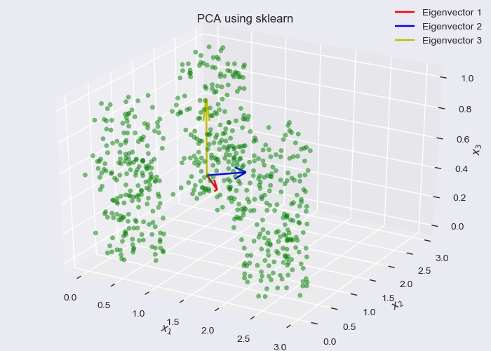
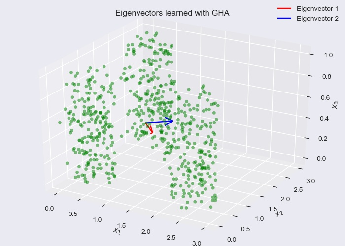
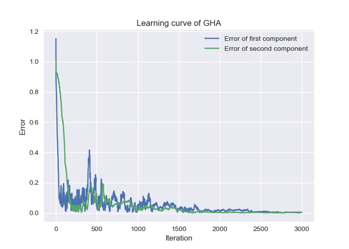
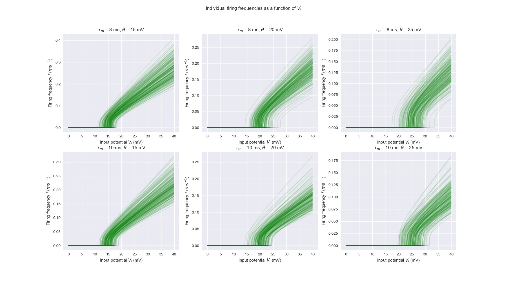
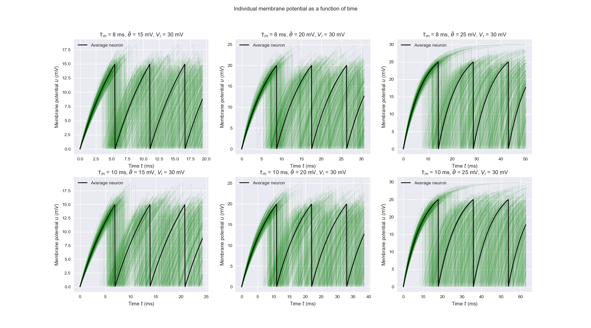
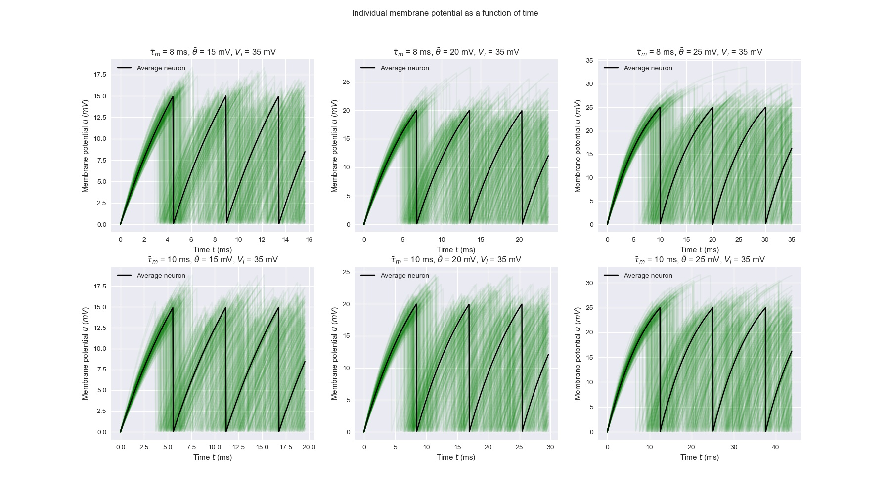

# Homework 2: PCA and Integrate-and-Fire Model

## Problem 1: Hebbian-Based Principal Component Analysis

We generalize 600 3-dimensional data points, each 200 
distributed uniformly in a cylindrical region. The principal 
components can be analyzed with `scikit-learn`, as shown below.

We can also use the generalized Hebbian algorithm, which yields 
the following result.

The algorithm converges quickly after a few epochs.

## Problem 2: Integrate-and-Fire Model

In problem (b), the membrane potential is plotted as
a function of time for various thresholds, time constants, 
and input potentials.

In problem (d), the firing frequency is plotted as 
a function of input potential for different cases 
of thresholds and time constants.

In problem (e), we generate 200 neurons with normally 
distributed time constants and thresholds. The total 
firing frequency is then plotted against input potential.

We also plot the individual firing frequencies and membrane
potential.

