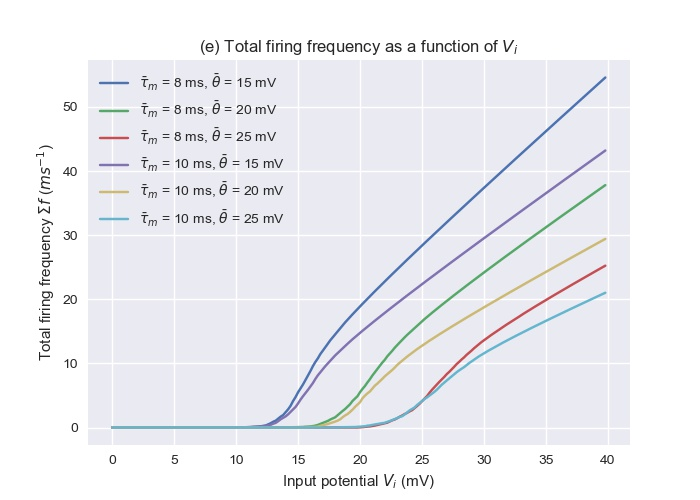

# Homework 2: PCA and Integrate-and-Fire Model

## Problem 2: Integrate-and-Fire Model

In problem (b), the membrane potential is plotted as
a function of time for various threshold, time constant, 
and potential constant values.

In problem (d), the firing frequency is plotted as 
a function of potential constant for different cases 
of thresholds and time constants

In problem (e), we generate neurons with the same potential 
constant but normally distributed time constants and 
thresholds. The total firing frequency is then plotted 
against potential constant.

