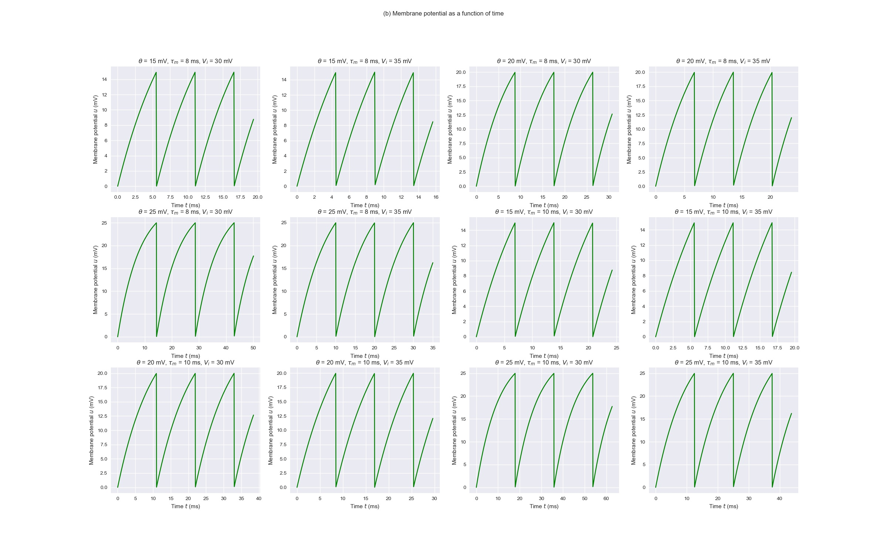

# Homework 2: PCA and Integrate-and-Fire Model

## Problem 2: Integrate-and-Fire Model

In problem (b), the membrane potential is plotted as
a function of time for various thresholds, time constants, 
and input potentials.

In problem (d), the firing frequency is plotted as 
a function of input potential for different cases 
of thresholds and time constants.

In problem (e), we generate 200 neurons with normally 
distributed time constants and thresholds. The total 
firing frequency is then plotted against input potential.

